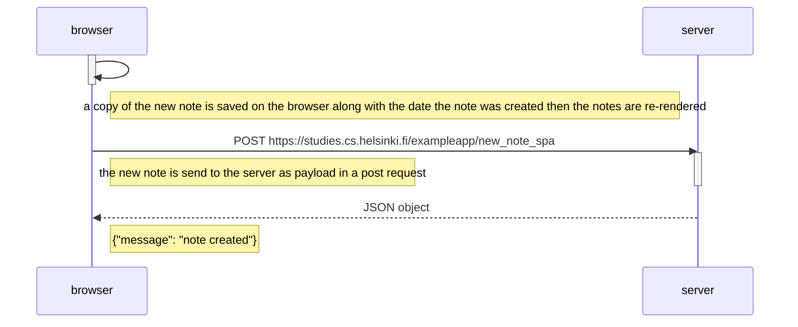

# 0.6 New note diagram in single page app

```mermaid
sequenceDiagram
    participant browser
    participant server


    activate browser
    browser->>browser: 
    deactivate browser
    Note right of browser: a copy of the new note is saved on the browser along with the date the note was created then the notes are re-rendered

    browser->>server: POST https://studies.cs.helsinki.fi/exampleapp/new_note_spa
    activate server

    Note right of browser: the new note is send to the server as payload in a post request

    
    deactivate server
    server-->>browser: JSON object

    Note right of browser: {"message": "note created"}

```